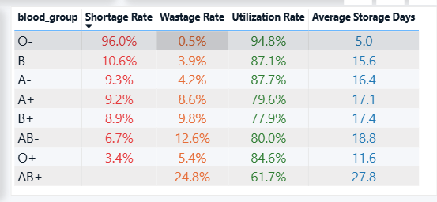
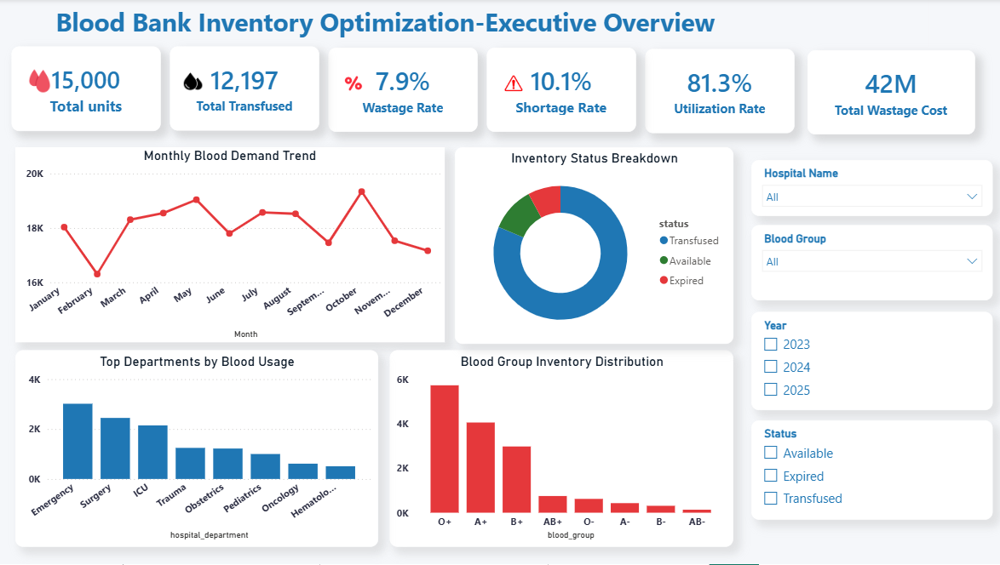
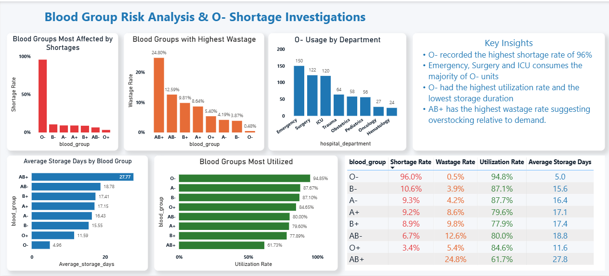
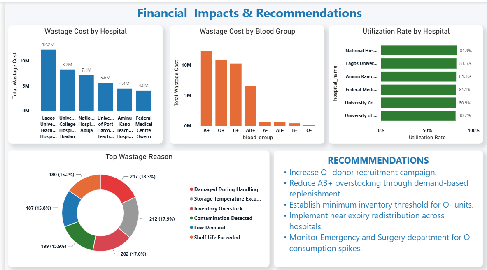

# 🩸 Blood Bank Inventory & Management — Data Analysis Case Study

## Table of Contents
- [Project Overview](#project-overview)
- [Business Problem](#business-problem)
- [Dataset](#dataset)
- [Tools & Technologies](#tools--technologies)
- [Data Workflow](#data-workflow)
- [Key Findings](#key-findings)
- [Recommendations](#recommendations)
- [Dashboard Preview](#dashboard-preview)
- [Project Structure](#project-structure)
- [How to Use This Repository](#how-to-use-this-repository)

---

## Project Overview

Blood banks operate in a high-stakes environment where inventory management directly impacts patient outcomes. Too little stock of a critical blood type can cost lives; too much leads to costly wastage as units expire. This project analyses blood bank inventory data to uncover patterns in shortages, wastage, utilisation, and demand — and to provide actionable recommendations for smarter inventory management.

---

## Business Problem

Blood bank managers face two simultaneous challenges:

- **Shortage risk:** Some blood types run critically low, especially during high-demand periods, leaving hospitals unable to meet patient needs.
- **Wastage cost:** Other blood types are overstocked and expire before use, resulting in significant financial loss and wasted donor contributions.

### Key Questions This Project Answers

1. Which blood types face the highest shortage and which face the highest wastage?
2. Which hospital departments consume the most of each blood type?
3. How does demand vary across months of the year?
4. Which hospitals incur the highest wastage costs?
5. How long do blood units remain in storage before use or expiry?

---

## Dataset

| Attribute | Detail |
|---|---|
| **Source** | Synthetically generated using Python |
| **Size** | 15,000 rows |
| **Scope** | Multiple hospitals, blood types, departments, and time periods |
| **Fields** | Blood type, hospital name, department, units collected, units used, units expired, storage duration, collection date, expiry date, wastage cost |

> The dataset was synthetically generated to mirror realistic blood bank operations while ensuring no real patient or donor data is used.

---

## Tools & Technologies

| Tool | Purpose |
|---|---|
| **SQL** | Data extraction, aggregation, and exploratory analysis |
| **Python** | Synthetic data generation and validation |
| **Power BI** | Interactive dashboard and data visualisation |

---

## Data Workflow

```
Raw Data Generation
   │
   ▼
Python (Data Generation & Validation)
   │  - Generated 15,000 rows of realistic synthetic data
   │  - Defined blood type distributions, hospital names, and departments
   │  - Validated data integrity and unit counts
   │  - Ensured consistency across fields before export
   ▼
SQL (Analysis)
   │  - Aggregated inventory levels by blood type and hospital
   │  - Calculated shortage rates, wastage rates, and utilisation rates
   │  - Computed average storage durations per blood type
   │  - Ranked departments by consumption
   │  - Analysed monthly demand trends
   ▼
Power BI (Visualisation)
      - Built interactive dashboard with filters by blood type, hospital, and period
      - Visualised KPIs: shortage rate, wastage rate, utilisation rate, wastage cost
      - Created trend charts, department breakdowns, and hospital comparisons
```

---

## Key Findings

### 1. 🚨 O- is in Critical Shortage
- **O- has the highest shortage rate at 96%**, making it the most at-risk blood type in the inventory.
- It also has the **highest utilisation rate at 94.9%**, meaning almost every unit collected is used — with very little buffer for demand surges.
- The **Emergency, Surgery, and ICU departments** are the primary consumers of O- blood, reflecting its role as the universal donor type in life-critical situations.
- O- units have the **shortest average storage duration of just 5 days**, indicating they are consumed almost immediately after collection.

### 2. 💸 AB+ Drives the Highest Wastage
- **AB+ has the highest wastage rate at 27.8%**, driven by consistent overstocking relative to actual demand.
- Its **average storage duration of ~28 days** — the longest of all blood types — suggests units are sitting in inventory far longer than necessary, increasing the risk of expiry.

### 3. 📅 Demand Peaks in October, Drops in February
- **October records the highest monthly demand**, likely aligned with seasonal health peaks, increased surgical activity, or accident rates.
- **February has the lowest demand**, presenting an opportunity to scale back procurement and reduce wastage risk during this period.

### 4. 🏥 Lagos University Teaching Hospital Has the Highest Wastage Cost
- **Lagos University Teaching Hospital (LUTH) incurred the highest wastage cost at ₦12.2 million**, indicating significant overstocking or poor rotation of blood units.
- **A+ has the highest wastage cost overall across the dataset**, pointing to systematic overordering of this blood type.

### Summary Table



---

## Recommendations

Based on the findings, the following actions are recommended for blood bank managers and procurement teams:

**1. Prioritise O- Collection Drives**
With a 96% shortage rate and near-total utilisation, O- stock is perpetually at risk. Blood banks should run targeted O- donor campaigns, especially ahead of October when demand peaks.

**2. Reduce AB+ Procurement**
A 24.8% wastage rate signals that AB+ is being ordered well beyond actual demand. Procurement quantities should be reduced and aligned more closely with consumption data. Implementing a first-in-first-out (FIFO) rotation policy would also reduce expiry risk.

**3. Implement Seasonal Procurement Planning**
Increase stock levels across all blood types heading into October and scale back procurement in February. Monthly demand data should be built into procurement forecasting models.

**4. Address Wastage at Lagos University Teaching Hospital**
LUTH's wastage cost of ₦12.2M warrants a review of its ordering policies, storage capacity, and inter-hospital transfer protocols. Excess units, particularly A+ and AB+, should be redistributed to hospitals with higher demand rather than left to expire.

**5. Maintain Fast-Track Protocols for Emergency Departments**
Since Emergency, Surgery, and ICU departments are the top consumers of O-, blood banks should maintain dedicated O- reserves for these departments with automatic replenishment triggers.

**6. Promote Compatible Blood Group Substitution Where Clinically Appropriate**
To preserve scarce O- inventory, hospitals should establish clinical protocols that encourage the use of ABO-compatible blood groups wherever medically appropriate. O- units should be reserved strictly for O- patients, emergency transfusions, and cases where no compatible alternative is available. This ensures that the universal donor supply is protected for situations where it is truly irreplaceable.

---

## Expected Business Impact

Effective implementation of these recommendations is projected to deliver measurable improvements across both clinical and operational dimensions:

| Impact Area | Expected Outcome |
|---|---|
| **Blood Product Availability** | Significant reduction in critical shortages, particularly for high-demand types such as O- |
| **Wastage & Financial Loss** | Lower expiry rates and reduced wastage costs, especially for AB+ and A+ |
| **Inventory Utilisation** | More balanced stock levels aligned with actual consumption and seasonal demand patterns |
| **Patient Care Quality** | Greater reliability of blood supply during emergencies, surgeries, and peak-demand periods |
| **Procurement Efficiency** | Data-driven ordering cycles that respond proactively to demand trends rather than reactively to shortages |

By integrating operational blood bank data with business intelligence tools, this project demonstrates how healthcare organisations can leverage analytics to make more informed procurement decisions, minimise preventable waste, and ultimately strengthen the reliability and quality of patient care.

---

## Dashboard Preview









---

## Project Structure

```
blood-bank-inventory-analysis/
│
├── data/
│   └── cleaned               # Cleaned and validated data
│
├── sql/
│   └── analysis_queries.sql    # All SQL queries used for analysis
│
├── python/
│   └── data_generation.py      # Python script for synthetic data generation & validation
│
├── powerbi/
│   └── blood_bank_dashboard.pbix  # Power BI dashboard file
│
├── assets/
│   └── *.png                   # Dashboard screenshots
│
└── README.md
```

---

## How to Use This Repository

1. **Clone the repository**
   ```bash
   git clone https://github.com/romanusamarachi21-svg/blood-bank-inventory-analysis.git
   ```

2. **Explore the data** — start with the `/data/blood_bank_inventory_dataset.csv` folder for the analysis-ready dataset.

3. **Run the SQL queries** — open `sql/analysis_queries.sql` in any SQL client (PostgreSQL, MySQL, or SQL Server compatible).

4. **Open the dashboard** — load `powerbi/blood_bank_dashboard.pbix` in Power BI Desktop to interact with the visualisations.

---

## Author

**[Romanus Grace Amarachi]**
Data Analyst | SQL • Python • Power BI

[LinkedIn](https://linkedin.com/in/romanusamara) • [GitHub](https://github.com/romanusamarachi21-svg) • [Portfolio](https://romanusamarachi21-svg.github.io/portfolio/)

---

*This project uses a simulated dataset for portfolio and educational purposes. No real patient or donor data was used.*

---

